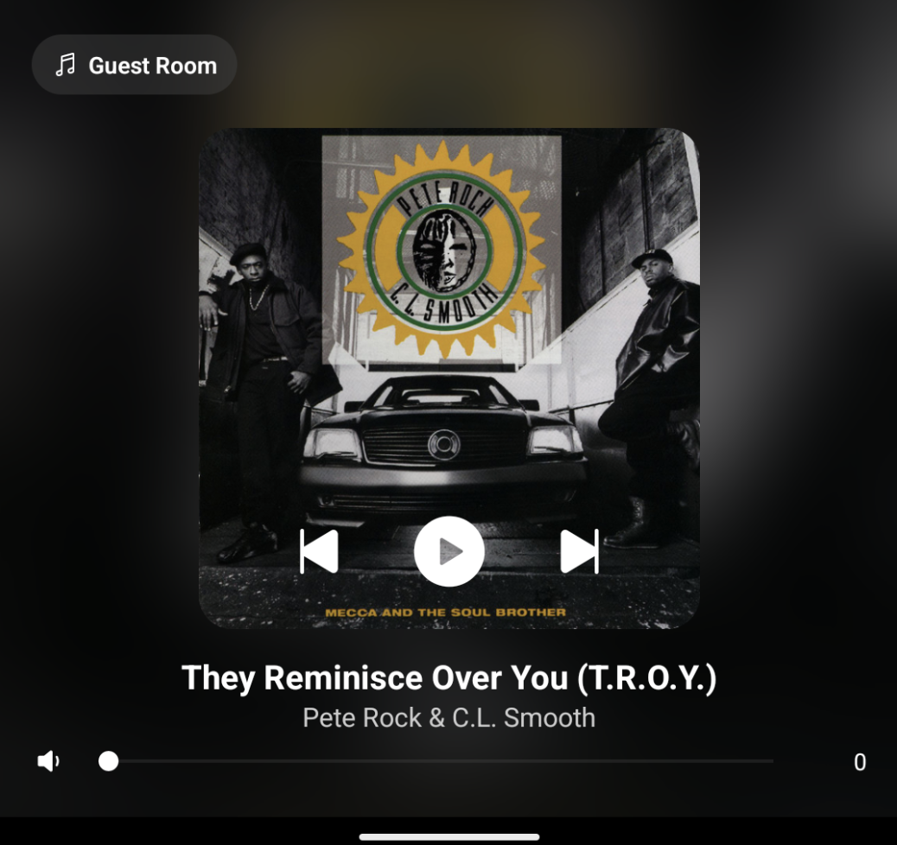

# Sonos-NowPlaying

A lightweight, self-contained Sonos controller consisting of:

- **Backend** (Node.js): Local API server for Sonos speaker discovery and control
- **Frontend** (React Native): Wall-mounted Android UI for playback and volume control

---

## ⚙️ Project Setup

### 1. Clone the Repository

```bash
gh repo clone sambatesdesign/Sonos-NowPlaying
cd Sonos-NowPlaying
```

---

## 🧠 Backend (Node.js)

### 📁 Location

`Backend/`

### 🔧 Setup & Run

```bash
cd Backend
npm install
node main.js
```

This will start a local server that:

- Discovers Sonos players
- Exposes endpoints like:
  - `/players` – list speakers
  - `/status?host=...` – now playing info
  - `/control` – play/pause/skip
  - `/volume` – set volume

---

## 📱 Frontend (React Native)

### 📁 Location

`Frontend/`

### 🔧 Setup

```bash
cd Frontend
npm install
```

### ▶️ Run in Emulator or Device

```bash
npx react-native run-android
```

You can also build an APK for sideloading:

```bash
cd Frontend/android
./gradlew assembleRelease
```

APK will be located in:

```
Frontend/android/app/build/outputs/apk/release/app-release.apk
```

---

## 🔑 Frontend Features

- Minimal touch UI with volume slider and playback buttons
- Auto-selects last used speaker
- Triple-tap album artwork to open settings
- Settings panel:
  - Update backend server IP
  - Restart app
  - Exit app

---

## 🖼 Frontend UI Preview

Below is a screenshot of the SonosNow React Native app running on a wall-mounted Android screen:



---

## 🔐 Environment Notes

- No external Sonos cloud API access is needed
- All control is via LAN using [@svrooij/sonos](https://github.com/svrooij/node-sonos-ts)

---

## 🧼 Folder Structure

```
Sonos-NowPlaying/
├── Backend/
│   ├── main.js
│   ├── package.json
│   └── ...
├── Frontend/
│   ├── App.tsx
│   ├── android/
│   ├── ios/
│   └── ...
└── README.md
```
